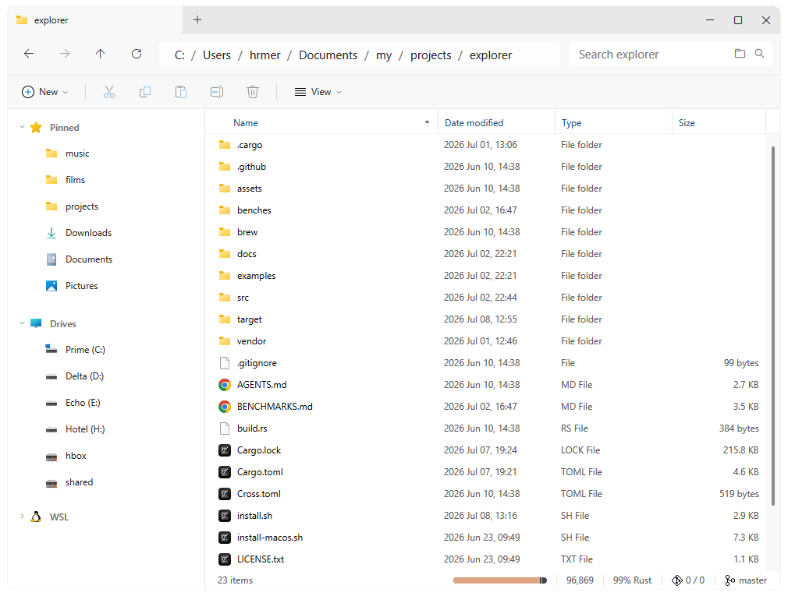

<p align="center">
  
</p>

<h1 align="center">Explorer</h1>

<p align="center">
  <strong><s>Windows</s> File Explorer for macOS, Linux, and Windows. Built in pure Rust with <a href="https://gpui.rs/">GPUI</a>.</strong>
</p>

<p align="center">
  <a href="https://github.com/hmerritt/explorer/releases/latest"></a>
  <a href="https://coveralls.io/github/hmerritt/explorer?branch=master"></a>
  <a href="https://github.com/hmerritt/explorer/releases/latest"></a>
  <a href="./LICENSE.txt"></a>
</p>

<p align="center">
  <a href="#-install">💾 Install</a>
  |
  <a href="#-features">⚡ Features</a>
  |
  <a href="#-anti-features-that-will-not-be-implemented"><s>🔃 Anti-Features</s></a>
</p>



## 💾 Install

[**➡️ Manually Download The Latest Release Here**](https://github.com/hmerritt/explorer/releases/latest), or install via one of the supported package managers:

#### ➡️ macOS via Homebrew

> First launch may need approval in **System Settings → Privacy & Security**

```sh
brew install --cask hmerritt/tap/explorer
```

#### ➡️ Linux installer

```sh
curl -fsSL https://raw.githubusercontent.com/hmerritt/explorer/master/install.sh | sh
```

#### ➡️ Windows via Scoop

```sh
scoop bucket add hmerritt https://github.com/hmerritt/scoop-bucket
scoop install hmerritt/explorer
```

## ⚡ Features

- [x] Cross-platform macOS, Linux (Wayland/X11), and Windows
- [x] GPU-accelerated Explorer UI ([GPUI](https://gpui.rs/))
- [x] Search
    - [x] Type-to-search current directory
    - [x] Recursive search (much faster than Windows)
- [x] Tabs
- [x] Arrow keys navigation
- [x] Sidebar custom pins (drag-to-pin)
- [x] Key bindings for ~~everything~~ most things
- [x] Fast image and video previews on `Alt+hover`
- [x] Git support
    - [x] Branch
    - [x] Outgoing/Incoming commits
    - [x] Lines of code
    - [x] Primary language used
    - [x] Github-style language makup bar
- [x] File properties
    - [x] Generic file/folder information
    - [x] In-depth image/video/audio metadata
    - [x] Image EXIF tags (grouped and organised for ease-of-use)
    - [x] Image preview in properties
    - [x] Video frames preview in properties
- [x] A simple, functional, built-in image viewer (you can set `explorer` to the default image viewer)
- [x] Archive extraction (supported archive formats including `7z`, `bz2`, `gz`, `rar`, `tar`, `xz`, `zip`, `zst`)
- [x] Native ZIP creation with Finder-style `Compress` naming and progress

## 🔃 'Anti-Features' that will NOT be implemented

- [x] 3D Objects _that gets used as much as a welcome mat at a house that never has visitors_
- [x] File grouping _that randomly appears when you didn't set it_
- [x] List, Titles, and Content file view modes _that are as pointless as a screen door on a submarine_
- [x] Search _that takes as long as a cross-country flight_
- [x] Context menu delays _that take longer than my wife does when deciding where to eat_
- [x] _Claiming it's built in 'pure rust' when really it's just a WebView wrapper with basic app logic in rust_.

## Configuration

Explorer stores settings as JSON and watches the file for changes while the app is running.

- macOS: `~/.config/explorer/settings.json`
- Linux: `${XDG_CONFIG_HOME:-~/.config}/explorer/settings.json`
- Windows: `%USERPROFILE%/.config/explorer/settings.json`

Minimal example:

```json
{
    "app": {
        "start": "~/Downloads"
    },
    "view": {
        "media_preview_size": 400,
        "mode": "details",
        "search_mode": "detailed",
        "show_extensions": true,
        "show_hidden": false,
        "show_folder_sizes": false
    }
}
```

`view.search_mode` controls recursive search result density. It accepts `"detailed"`
(the default, with the full path beneath each filename) or `"compact"` (single-line
rows with the full path available on hover).

Example with sidebar and contextmenu items:

```json
{
    "app": {
        "start": "~/Downloads"
    },
    "view": {
        "mode": "details",
        "search_mode": "detailed",
        "show_extensions": true,
        "show_hidden": false,
        "show_folder_sizes": false
    },
    "sidebar": {
        "items": ["~", "~/Downloads", "~/Documents", "~/Pictures"],
        "width": 225
    },
    "contextmenu": [
        {
            "exe": "zed",
            "icon": "",
            "args": [],
            "label": "Open with Zed",
            "only": ["*directory", "*folders", "*files"]
        }
    ]
}
```

Context-menu entries can launch an external executable or invoke a built-in action. The native
no-dialog ZIP action is configured as:

```json
{
    "label": "Compress",
    "action": "compress",
    "only": ["*file", "*folder"]
}
```

## Development

Explorer is a Rust 2024 project using GPUI.

```sh
cargo check --locked
cargo test --locked --all-targets
cargo run
```

Useful project docs:

- [README-development.md](./README-development.md): platform notes, local installs, and development setup.
- [BENCHMARKS.md](./BENCHMARKS.md): benchmark suites for search, navigation, thumbnails, image viewing, properties, copy, and archive extraction.
- [docs/assets/README.md](./docs/assets/README.md): reproducible README screenshot workflow.

---

<small>
    <a href="https://www.flaticon.com/free-icons/folder" title="folder icons">Folder icons created by kmg design - Flaticon</a>
</small>
