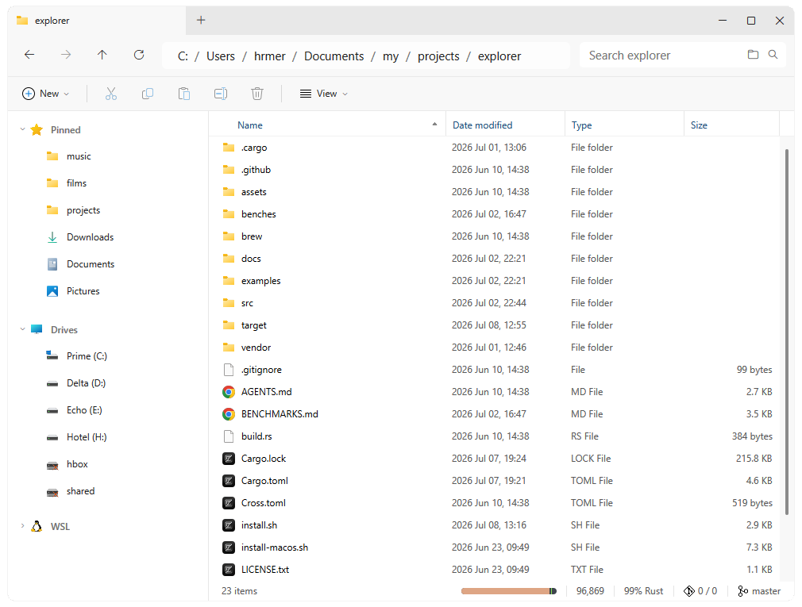

<p align="center">
  
</p>

<h1 align="center">Explorer</h1>

<p align="center">
  <strong><s>Windows</s> File Explorer for macOS, Linux, and Windows. Built in pure Rust with <a href="https://gpui.rs/">GPUI</a>.</strong>
</p>

<p align="center">
  <a href="https://github.com/hmerritt/explorer/releases/latest"></a>
  <a href="https://coveralls.io/github/hmerritt/explorer?branch=master"></a>
  <a href="https://github.com/hmerritt/explorer/releases/latest"></a>
  <a href="./LICENSE.txt"></a>
</p>

<p align="center">
  <a href="#-install">💾 Install</a>
  |
  <a href="#-features">⚡ Features</a>
  |
  <a href="#-anti-features-that-will-not-be-implemented"><s>🔃 Anti-Features</s></a>
</p>



## 💾 Install

[**➡️ Manually Download The Latest Release Here**](https://github.com/hmerritt/explorer/releases/latest), or install via one of the supported package managers:

#### ➡️ macOS via Homebrew

> First launch may need approval in **System Settings → Privacy & Security**

```sh
brew install --cask hmerritt/tap/explorer
```

#### ➡️ Linux installer

```sh
curl -fsSL https://raw.githubusercontent.com/hmerritt/explorer/master/install.sh | sh
```

#### ➡️ Windows via Scoop

```sh
scoop bucket add hmerritt https://github.com/hmerritt/scoop-bucket
scoop install hmerritt/explorer
```

## ⚡ Features

- [x] Cross-platform macOS, Linux (Wayland/X11), and Windows
- [x] GPU-accelerated Explorer UI ([GPUI](https://gpui.rs/))
- [x] Tabs
- [x] Arrow keys navigation
- [x] Sidebar custom pins (drag-to-pin)
- [x] Key bindings for ~~everything~~ most things
- [x] HTTP, HTTPS, FTP, and SFTP file URLs can be downloaded directly when pasted
- [x] `yt-dlp` integration, supported URLs can be downloaded as videos when pasted
- [x] Native ZIP creation with Finder-style `Compress` naming and progress
- [x] A simple, functional, built-in image viewer (you can set `explorer` as the default image viewer)
- [x] Archive extraction (supported archive formats including `7z`, `bz2`, `gz`, `rar`, `tar`, `xz`, `zip`, `zst`)
- [x] Search
    - [x] Type-to-search current directory
    - [x] Recursive search (no pre-indexing like Windows, but still pretty quick)
- [x] Git repo support
    - [x] Branch
    - [x] Outgoing/Incoming commits
    - [x] Lines of code
    - [x] Primary language used
    - [x] Github-style language makup bar
- [x] `Alt+hover` special keybinding to instantly preview files
    - [x] Images
    - [x] Videos
    - [x] PDF first-page preview
    - [x] Text (plain text, logs, markdown, code files, etc...)
- [x] File properties
    - [x] Generic file/folder information
    - [x] Image preview in properties
    - [x] Video frames preview in properties
    - [x] In-depth image/video/audio metadata
    - [x] Audio spectrum analyser (inspired by [Spek](https://www.spek.cc/))
    - [x] Image EXIF tags (grouped and organised for ease-of-use)
- [x] Removable and portable storage
    - [x] Native mounted volumes, USB mass storage, and optical media
    - [x] Android phones, cameras, and media players using MTP/PTP
    - [x] In-app copy/move, rename, folder creation, delete, thumbnails, and file opening when supported by the device

## 🔃 'Anti-Features' that will NOT be implemented

- [x] 3D Objects _that gets used as much as a welcome mat at a house that never has visitors_
- [x] File grouping _that randomly appears when you didn't set it_
- [x] List, Titles, and Content file view modes _that are as pointless as a screen door on a submarine_
- [x] Search _that takes as long as a cross-country flight_
- [x] Context menu delays _that take longer than my wife does when deciding where to eat_
- [x] _Claiming it's built in 'pure rust' when really it's just a WebView wrapper with basic app logic in rust_.

---

https://github.com/user-attachments/assets/cf7ca1d4-1609-4270-88e4-0798fad9b38a

> Downloading a file URL directly into the current directory.

---

## Configuration

Explorer stores settings as JSON and watches the file for changes while the app is running.

- macOS: `~/.config/explorer/settings.json`
- Linux: `${XDG_CONFIG_HOME:-~/.config}/explorer/settings.json`
- Windows: `%USERPROFILE%/.config/explorer/settings.json`

Minimal example:

```json
{
    "app": {
        "copy_verify": true,
        "start": "~/Downloads"
    },
    "view": {
        "media_preview_size": 400,
        "mode": "details",
        "search_mode": "detailed",
        "show_extensions": true,
        "show_hidden": false,
        "show_folder_sizes": false
    }
}
```

`app.copy_verify` controls the final read-back verification for newly copied files. It defaults
to `true`; set it to `false` to skip that verification while retaining checks needed for existing
destinations, resumable copies, and safe fallback behavior.

`view.search_mode` controls recursive search result density. It accepts `"detailed"`
(the default, with the full path beneath each filename) or `"compact"` (single-line
rows with the full path available on hover).

Example with sidebar and contextmenu items:

```json
{
    "app": {
        "start": "~/Downloads",
        "ytdlp_options": ["-S", "ext:mp4"]
    },
    "view": {
        "mode": "details",
        "search_mode": "detailed",
        "show_extensions": true,
        "show_hidden": false,
        "show_folder_sizes": false
    },
    "sidebar": {
        "hide_groups": ["network", "wsl"],
        "hide_items": ["google_drive", "C:/"],
        "items": ["~", "~/Downloads", "~/Documents", "~/Pictures"],
        "width": 225
    },
    "contextmenu": [
        {
            "exe": "zed",
            "icon": "",
            "args": [],
            "label": "Open with Zed",
            "only": ["*directory", "*folders", "*files"]
        }
    ]
}
```

`app.ytdlp_options` is an array of command-line arguments passed to `yt-dlp`
when a supported video URL is pasted into a folder. For example,
`["--cookies-from-browser", "firefox"]`. Explorer invokes `yt-dlp` directly,
so each array entry is passed as one argument without shell parsing. The default
is `["-S", "ext:mp4"]`, which prefers MP4 output.

`sidebar.hide_groups` removes matching groups from the sidebar. It accepts
`"pinned"`, `"drives"`, `"network"`, and `"wsl"`; the default is an empty array.

`sidebar.hide_items` removes individual non-Pinned sidebar items. It accepts the reserved
provider IDs `"google_drive"` and `"onedrive"`, plus absolute filesystem or Explorer virtual
paths for drives, mapped shares, portable devices, and WSL distributions. Its default is an
empty array. The sidebar Hide context-menu action appends the corresponding value; remove it
from this array to restore the item. On Windows, visible Google Drive and OneDrive roots are
discovered from their default sync locations and appear in the Network group.

Context-menu entries can launch an external executable or invoke a built-in action. The native
no-dialog ZIP action is configured as:

```json
{
    "label": "Compress",
    "action": "compress",
    "only": ["*file", "*folder"]
}
```

## Development

## SFTP servers

Click **Connect** to name a site and enter `sftp://user@host:22/folder/`, or use
an alias from `~/.ssh/config`, such as `sftp://my-server/`. Saved sites appear
under Network. To update or forget a saved site, open it and click Connect again.
You can also enter an SFTP address directly in the address bar without saving it.

Browse servers in ordinary tabs or split panes. Copy and paste between local
and remote folders, or drag files between panes, to upload or download recursively.
Cut and paste moves files; source deletion follows successful transfer. Moves
within the same saved server use SFTP rename. Pasted SFTP URLs use the same queue.

The Server transfers panel shows application-wide jobs that continue when you
navigate elsewhere. Pause and Cancel retain partial data; Resume validates that
data before continuing. Interrupted jobs reopen paused after an application
restart. Conflict controls provide replacement, skipping, and keeping both names.
**Discard partials** removes retained temporary files and the saved job, while
leaving completed destination files in place. Dismiss removes a finished job.

SSH authentication supports ordinary direct aliases, identity files, encrypted-key
passphrases, password prompts, and SSH agents (including Windows OpenSSH/Pageant).
Explorer checks server keys against known-host files, prompts for unknown keys,
and rejects changed keys. Passwords and key passphrases are kept only in memory.
Site and transfer JSON files are stored beside Explorer's settings.

Transfers use temporary destination files, checked close/flush operations, size
checks, source/destination change checks, and atomic publication where available.
Replacing remote files requires the server's OpenSSH atomic-rename extension and
preserves reported ownership and permissions; otherwise Explorer retains the
original and asks you to choose another action. Enable **Verify content for new
transfers** for a full SHA-256 comparison, which rereads both files. These checks
do not provide a snapshot of a file being edited concurrently; transfer stable
source files.

This is the first native SFTP implementation, not complete WinSCP parity. Remote
editing with automatic upload, synchronization, SCP/FTP/FTPS/WebDAV/S3 browsing,
jump hosts, keyboard-interactive/MFA, and SSH certificates are not implemented.
Remote properties are read-only. To open a remote file, download it first.
Remote-to-remote copying currently goes through a local folder. Symbolic links
are preserved without recursively following them; downloading links to Windows
requires skipping them or using a Unix filesystem. Server deletes are permanent
and use Explorer's permanent-delete confirmation.

### Development

Explorer is a Rust 2024 project using GPUI.

```sh
cargo check --locked
cargo test --locked --all-targets
cargo run
```

Useful project docs:

- [README-development.md](./README-development.md): platform notes, local installs, and development setup.
- [BENCHMARKS.md](./BENCHMARKS.md): benchmark suites for search, navigation, thumbnails, image viewing, properties, copy, and archive extraction.
- [docs/assets/README.md](./docs/assets/README.md): reproducible README screenshot workflow.

---

<small>
    <a href="https://www.flaticon.com/free-icons/folder" title="folder icons">Folder icons created by kmg design - Flaticon</a>
</small>
